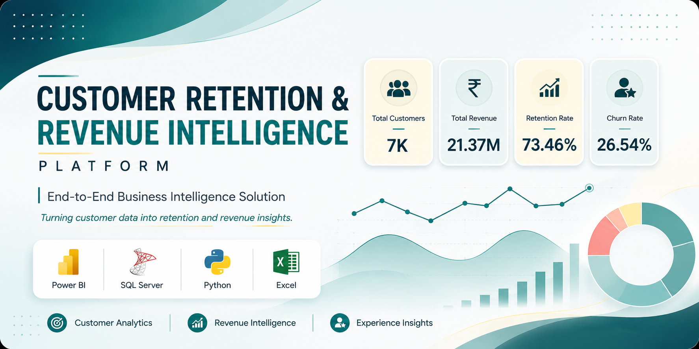
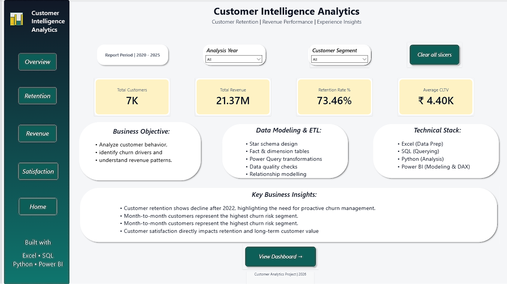
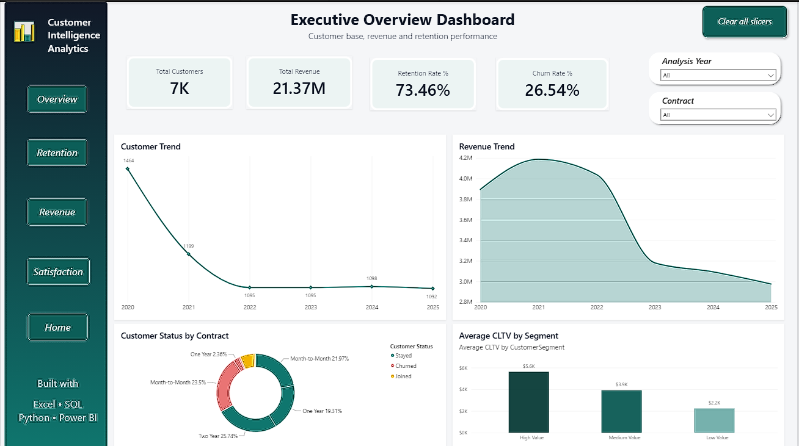
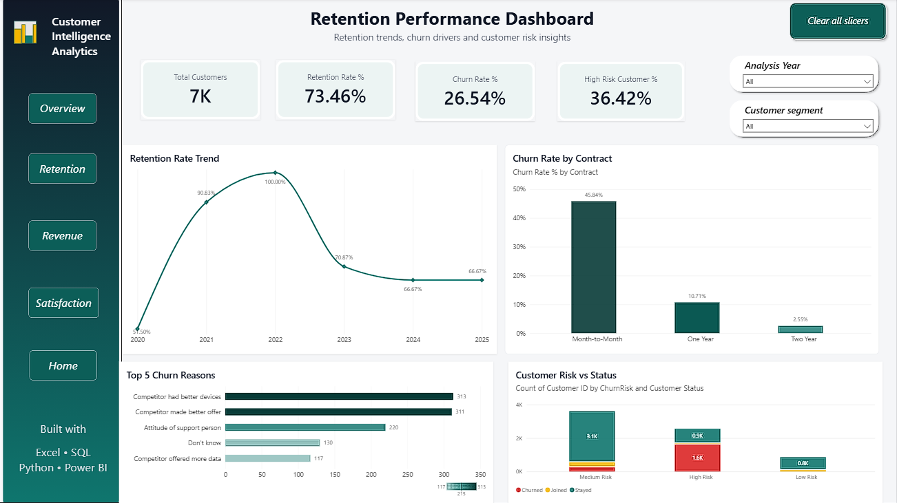
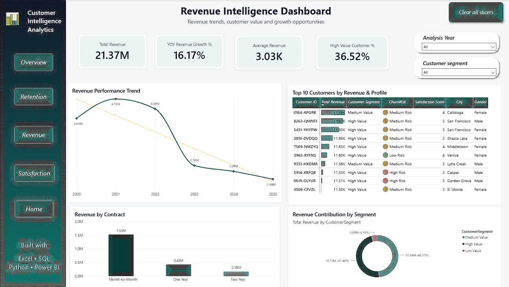
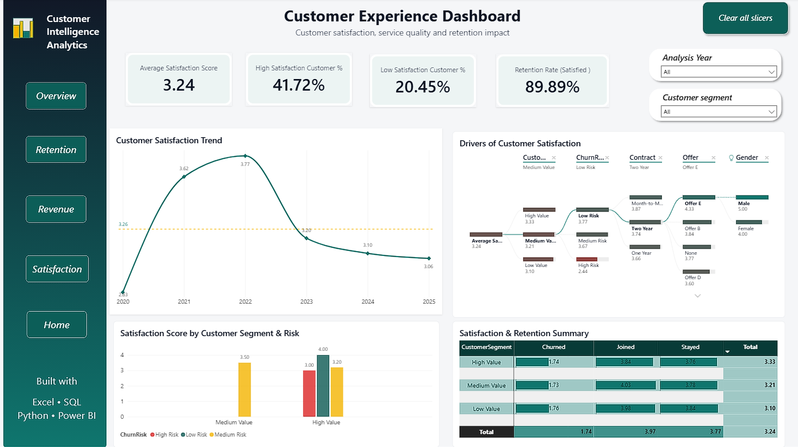
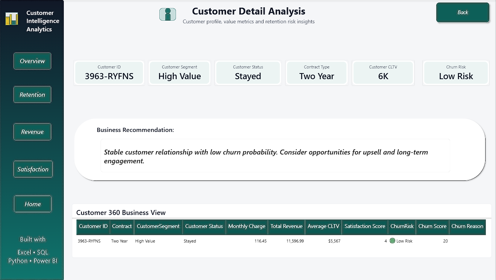

<p align="center">
  
</p>

# Customer Retention & Revenue Intelligence Platform

An end-to-end Business Intelligence solution built using **Power BI, SQL Server, Python, and Excel** to analyze customer retention, revenue performance, customer satisfaction, and subscription behavior.

---

# Project Snapshot

| Category | Details |
|----------|----------|
| Domain | Customer Analytics & Business Intelligence |
| Industry | Subscription-Based Business |
| Tools | Power BI, SQL Server, Python, Excel |
| Data Model | Star Schema |
| Dashboard Pages | 6 Interactive Reports |
| KPIs | Total Customers, Revenue, Retention Rate, Churn Rate |

---

# Business Problem

Businesses need a centralized analytical solution to monitor customer retention, identify churn risks, understand customer satisfaction, and optimize revenue performance.

This project transforms raw operational data into an interactive Business Intelligence dashboard that supports data-driven decision-making.

---

# Dashboard Pages

## 1. Home

Introduces the project, explains the business objective, and provides report navigation.

<p align="center">

</p>

---

## 2. Executive Overview

Provides a high-level summary of business performance.

### KPIs

- Total Customers
- Total Revenue
- Retention Rate %
- Churn Rate %

### Highlights

- Customer Trend
- Revenue Trend
- Customer Status by Contract
- Average Customer Lifetime Value

<p align="center">

</p>

---

## 3. Retention Dashboard

Analyzes customer retention trends and identifies churn risks.

### Highlights

- Retention Trend
- Churn Rate
- Contract Analysis
- Customer Risk Distribution

<p align="center">

</p>

---

## 4. Revenue Dashboard

Provides revenue analysis across customer segments and subscription plans.

### Highlights

- Revenue Trend
- Revenue by Contract
- Top Customers
- Revenue Distribution

<p align="center">

</p>

---

## 5. Customer Experience Dashboard

Measures customer satisfaction and its relationship with customer retention.

### Highlights

- Satisfaction Score
- Customer Segmentation
- Decomposition Tree
- Satisfaction vs Retention

<p align="center">

</p>

---

## 6. Customer Detail (Drill-through)

Provides a complete 360° customer profile for detailed investigation.

### Includes

- Customer Profile
- Subscription Details
- Customer Lifetime Value
- Satisfaction
- Churn Risk
- Business Recommendation

<p align="center">

</p>

---

# Data Model

The solution follows a **Star Schema** for efficient analytical reporting.

### Dimension Tables

- DimCustomer
- DimCustomerSatisfaction
- DimDate
- DimSubscription

### Fact Tables

- FactRevenue
- FactRetention

This model improves query performance, simplifies relationships, and supports scalable reporting.

---

# Technology Stack

| Technology | Purpose |
|------------|---------|
| Microsoft Excel | Source Dataset |
| SQL Server | Database & Data Validation |
| Python (Pandas) | Data Cleaning & Exploratory Analysis |
| Power BI | Dashboard Development |
| DAX | KPI Calculations |
| Star Schema | Data Modeling |

---

# Key Features

### Power BI

- Executive Dashboard
- Interactive Navigation
- Drill-through Analysis
- Dynamic Slicers
- Cross-filtering
- KPI Cards
- Responsive Report Design

### SQL

- Database Creation
- Data Validation
- Business Queries

### Python

- Data Cleaning
- Missing Value Analysis
- Duplicate Detection
- Exploratory Data Analysis

---

# Business Value

This solution enables stakeholders to:

- Monitor customer retention performance
- Track revenue growth
- Identify high-value customers
- Detect churn risks
- Evaluate customer satisfaction
- Support customer-centric business decisions

---

# Repository Structure

```text
Customer-Retention-Revenue-Intelligence-Platform
│
├── Assets
├── Dataset
├── Documentation
├── Images
├── Power BI
├── Python
├── SQL
└── README.md
```

---

# Future Enhancements

- Machine Learning-based Churn Prediction
- Automated Power BI Service Refresh
- Mobile Dashboard
- Customer Lifetime Value Prediction
- Row-Level Security (RLS)
- Real-Time Data Integration

---

# About the Author

**Chhavi Chauhan**

Data Analyst with 2 years of experience specializing in Business Intelligence, Power BI, SQL, Python, and Excel.

This project demonstrates an end-to-end Business Intelligence workflow covering data preparation, validation, modeling, dashboard development, and business storytelling.

### Technical Skills

- Power BI
- SQL Server
- Python (Pandas)
- Microsoft Excel
- DAX
- Data Modeling
- Exploratory Data Analysis
- Business Intelligence

---

If you found this project helpful or would like to connect, feel free to reach out through my GitHub or LinkedIn profile.
